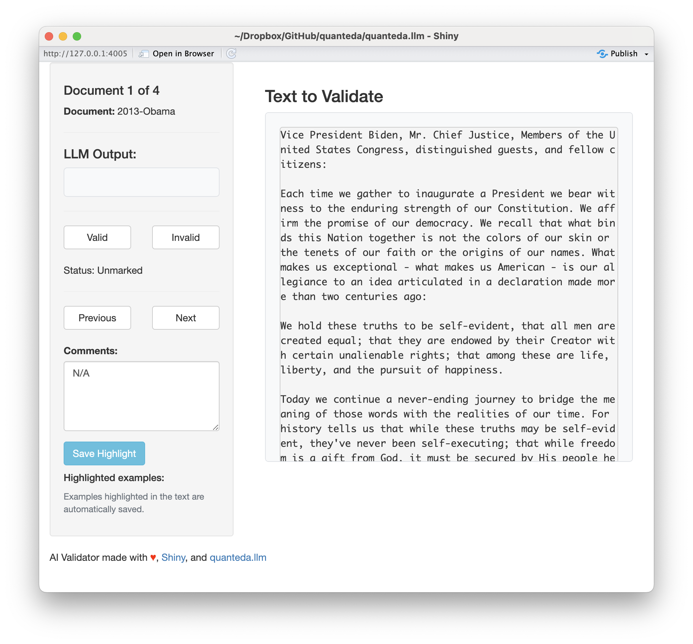

```{r setup, include=FALSE}
knitr::opts_chunk$set(echo = TRUE)
```

The `ai_validate()` function allows users to manually check and validate the responses generated by the LLM with a user-friendly Shiny app. Such manual checks are essential for ensuring the quality and accuracy of the LLM's output. The function can be used to review the scores and justifications generated by the LLM, and users can also highlight and save examples from the original texts that support the validated text classifications. The saved examples can be used for further qualitative analyses or to built a labelled dataset for fine-tuning open-source LLMs to receive improved performance on similar tasks.

### Loading packages and data

```{r getting-started}
library(quanteda)
library(quanteda.llm)

data_corpus_inaugural <- tail(data_corpus_inaugural, 3)
```

### Using `ai_validate()` to manually check LLM-generated outputs

```{r ai_score, eval = TRUE}
prompt <- "Score the following document on a scale of how much it aligns 
with the political left. The political left is defined as groups 
which advocate for social equality, government intervention in the 
economy, and progressive policies. Use the following metrics: 

SCORING METRIC: 
3 : extremely left 
2 : very left 
1 : slightly left 
0 : not at all left"

result <- ai_score(data_corpus_inaugural, prompt, chat_fn = chat_openai, 
                   model = "gpt-4o",
                   api_args = list(temperature = 0, seed = 42))
```

Now validate the scores and return the result:
```{r validate, eval = FALSE}
ai_validate(data_corpus_inaugural, result)
```

```{r, echo=FALSE, fig.cap="AI Validate Screenshot", out.width="100%"}

```

